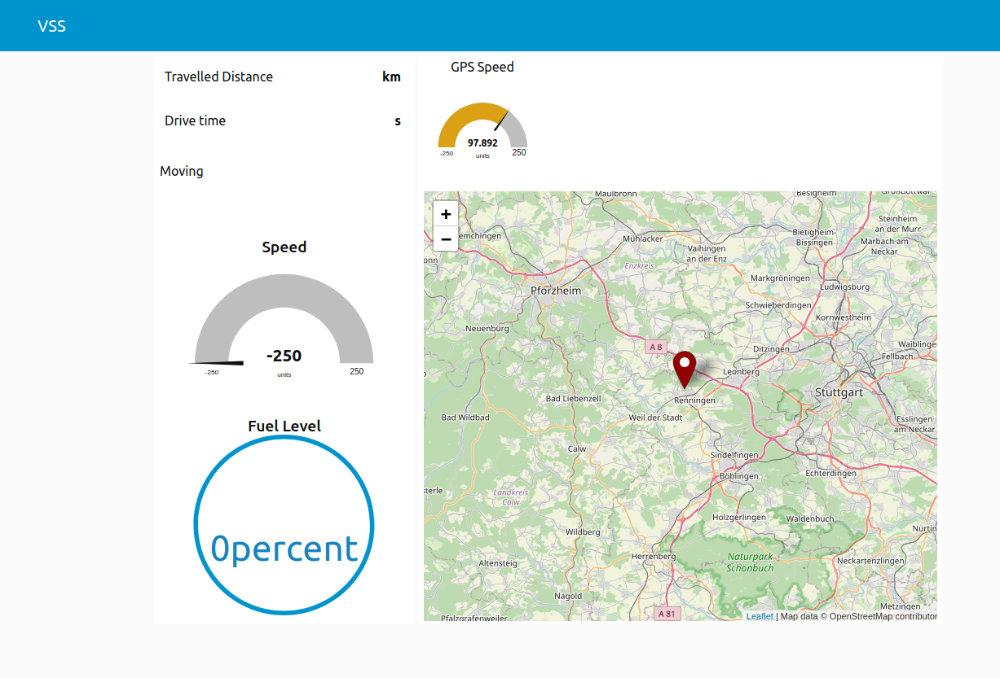

# Flow for node-red dashboard

After installing [node-red](https://nodered.org/), you can import the json file to receive data from kuksa-val-server. Then you can use the node-red dashboard feature to view data.

## Dependencies
### Node-red extensions
The following node red extensions are used in the example flows:
- [node-red-dashboard](https://flows.nodered.org/node/node-red-dashboard)
- [node-red-contrib-web-worldmap](https://flows.nodered.org/node/node-red-contrib-web-worldmap)

### Installation
You can use docker to start `node-red` and `kuksa.val` server.
You need install a mqtt broker for using the mqtt example and load `kuksa.val` docker images:
```
sudo apt install docker.io mosquitto

wget https://github.com/eclipse/kuksa.val/releases/download/0.1.8/kuksa-val-0.1.8-amd64.tar.xz
docker load -i kuksa-val-0.1.8-amd64.tar.xz
```

Or for arm64:
```
wget https://github.com/eclipse/kuksa.val/releases/download/0.1.8/kuksa-val-0.1.8-arm64.tar.xz
docker load -i kuksa-val-0.1.8-arm64.tar.xz
```

Then start all needed container using [`docker-compose.yml`](./docker-compose.yml):
```
sudo apt  install docker-compose
ARCH=arm64 docker-compose up
```

## MQTT
[mqtt-examples.json](./mqtt-examples.json) subscribes some mqtt topics, which will be published by kuksa-val-server

*Note*: Do not forget to config your kuksa-val-server to publish the needed topics using the option `--mqtt.publish`.

## Websocket
- [websocket-subscription.json](./websocket-subscription.json) do the same like the mqtt example above via websocket subscription feature.
- [websocket-advanced.json](./websocket-advanced.json) implements a test client and uses secure connection with server



